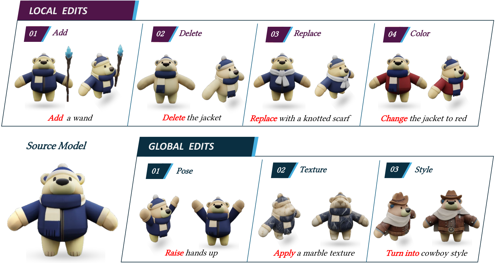

# PriorEdit3D

### Learning 3D Editing without Paired Supervision via Generative Prior Distillation

**SIGGRAPH Asia 2026 — Conference Papers**

[Project Page](https://thiamine128.github.io/PriorEdit3D/) · [Paper](https://arxiv.org/abs/2609.04942) · [PDF](https://arxiv.org/pdf/2609.04942) · [DOI](https://doi.org/10.1145/3829340.3842352)

PriorEdit3D learns instruction-guided, feed-forward 3D editing without paired 3D supervision by distilling visual, semantic, and geometric priors from pretrained foundation models.



## Method


Our editor learns from three complementary signals:

- **2D visual supervision** transfers edits from an image-editing teacher.
- **VLM semantic feedback** encourages instruction following and source identity preservation across views.
- **3D distribution matching** regularizes geometry using a pretrained image-to-3D teacher.

## Training

Run the following commands from the repository root in a CUDA environment with PyTorch, PyTorch Lightning, and DeepSpeed. Prepare training data and compatible pretrained weights first; these and a complete environment specification are not included in the current release.

### 1. Warmup

[warmup_lightning.py](warmup_lightning.py) trains the editor with a flow-matching objective. The supplied configuration references `EditingImageConditionedUniLat`, which is not included in the dataset package; provide that implementation or adapt the configuration to a compatible warmup dataset before running.

```bash
python warmup_lightning.py \
  --config configs/editing/warmup_pl.json \
  --data_dir /path/to/prepared/data \
  --output_dir outputs/warmup \
  --num_gpus 1 \
  --init_ckpt /path/to/initialization.ckpt
```

`--init_ckpt` optionally initializes model weights. To resume training, use `--load_dir outputs/warmup --ckpt latest`.

### 2. Unpaired editing

[unpaired_lightning.py](unpaired_lightning.py) trains with visual and VLM supervision plus 3D distribution matching, using [mix.json](configs/editing/mix.json) and [DeepSpeed](configs/deepspeed_config.json).

Before launching:

- Configure the dataset roots in [mix.py](unilat3d/datasets/mix.py): `./datasets/objaverse/` and `./datasets/character/`. The tracked entries are path placeholders; `--data_dir` alone does not redirect this loader.
- Set `gs_decoder` and `gen_model` in `mix.json` to compatible pretrained model paths. Provide DINOv3 code at `external/dinov3` and weights at `external/dinov3_vith16plus_pretrain_lvd1689m-7c1da9a5.pth`.
- Supply editor and auxiliary initialization checkpoints with `model.`-prefixed weights inside their Lightning `state_dict`.

```bash
python unpaired_lightning.py \
  --config configs/editing/mix.json \
  --output_dir outputs/prioredit3d \
  --edit_model_ckpt /path/to/editor_init.ckpt \
  --aux_model_ckpt /path/to/auxiliary_init.ckpt
```

Checkpoints and TensorBoard logs are saved under the output directory in `lightning_ckpts/` and `tb_logs/`. Training automatically resumes from `lightning_ckpts/last.ckpt` when present; use `--resume_from /path/to/checkpoint.ckpt` to select a checkpoint explicitly.

## Inference

[inference.sh](inference.sh) contains `infer_mix` for the editing model and `infer_unilat` for the UniLat baseline; it currently invokes the latter on GPU 6. Update its model, input, and output paths and GPU selection for your setup. The referenced `tests/inference_edit.py` and `tests/unilat_inference.py` are not included, so the script cannot run as shipped.

## Citation

```bibtex
@inproceedings{wen2026prioredit3d,
  title     = {Learning {3D} Editing without Paired Supervision via Generative Prior Distillation},
  author    = {Wen, Hao and Yun, Weibin and Fan, Hongxing and Lu, Haotian and
               Chen, Rui and Huang, Zehuan and Sheng, Lu},
  booktitle = {SIGGRAPH Asia 2026 Conference Papers},
  series    = {SA Conference Papers '26},
  year      = {2026},
  doi       = {10.1145/3829340.3842352},
  url       = {https://doi.org/10.1145/3829340.3842352}
}
```

## License

[Apache License 2.0](LICENSE). Third-party components and model weights retain their respective licenses.
